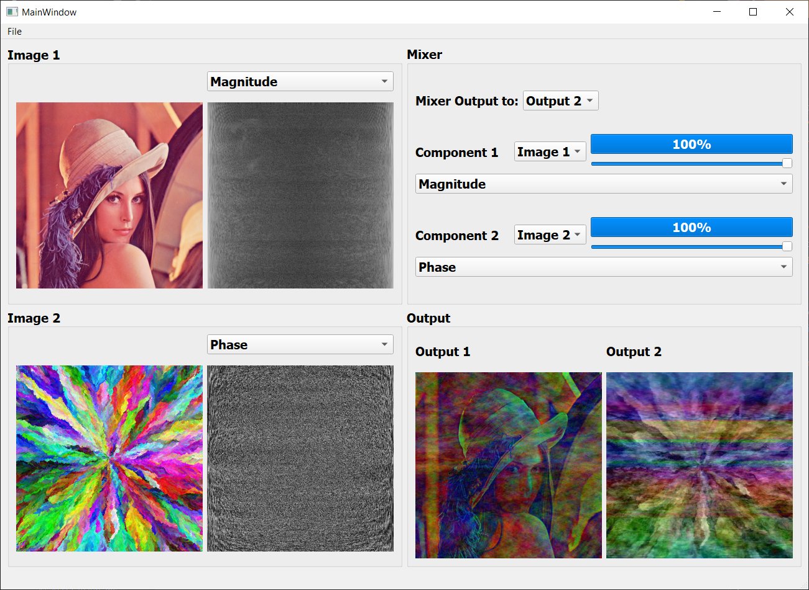

# image-mixer

<p align="center">
  
  
</p>

<p align="center">
    
</p>

## Table of Contents

-   [About the Project](#about-the-project)
-   [Toolbox](#toolbox)
-   [Setting Up the Environment](#setting-up-the-environment)

## About The Project

A GUI Application for the Fast Fourier Transform. Mixing the Magnitude and Phase of the Complex Domain of Two Images.

## Toolbox

-   Python
    -   PyQt5
    -   matplotlib
    -   numpy

## Setting Up the Environment

1. Clone the repo
    - HTTPS
        ```sh
        git clone https://github.com/RamadanIbrahem98/image-mixer.git
        ```
    - SSH
        ```sh
        git clone git@github.com:RamadanIbrahem98/image-mixer.git
        ```
1. Create a Virtual Environment (Optional)
    ```sh
    python -m venv .env
    ```
1. Activate the virtual environment

    - using CMD
        ```sh
        .\.env\Scripts\activate
        ```
    - using PowerShell
        ```sh
        .\.env\Scripts\Activate.ps1
        ```
    - using Bash
        ```sh
        source .env/bin/activate
        ```

1. Install the requirements and dependancies
    ```sh
    pip install -r requirements.txt
    ```
1. Run the application
    ```sh
    python main.py
    ```
